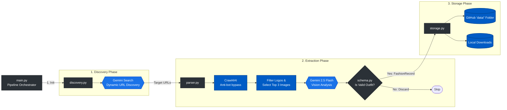

# Fashion Analytics Scraper

An autonomous fashion analytics pipeline that runs daily via GitHub Actions. It dynamically discovers independent fashion blogs, scrapes them using `crawl4ai`, extracts fashion metadata using Google Gemini (`gemini-2.5-flash`), and saves the structured data to the repository.

## Table of Contents
- [Dataset Overview](#dataset-overview)
- [Pipeline Architecture](#pipeline-architecture)
- [What It Scrapes](#what-it-scrapes)
- [Dependency Management](#dependency-management)
- [Setup](#setup)

## Dataset Overview
<!-- DATASET_OVERVIEW_START -->
**Last Updated:** 2026-07-24 04:19:40 UTC

- **Total Days/Files:** 41
- **Total Outfits:** 481

| Variable | Description | Fill Rate | Distinct Values |
|----------|-------------|-----------|-----------------|
| `accessories` | List of visible accessories. | 74.2% (357) | 227 |
| `age_group` | Visually estimated age bracket. | 81.9% (394) | 5 |
| `bottom_garment_type` | The type of bottom being worn. | 51.6% (248) | 141 |
| `brand_mentions` | Fashion brands explicitly mentioned. | 8.1% (39) | 33 |
| `clothing_fit` | The overall fit of the clothing. | 81.7% (393) | 4 |
| `clothing_style` | The primary fashion style. | 100.0% (481) | 130 |
| `color_palette_type` | The overall color theory of the outfit. | 81.9% (394) | 5 |
| `confidence_score` | Model confidence score (0.0 to 1.0). | 100.0% (481) | 8 |
| `date_scraped` | Automatically injected date. | 100.0% (481) | 41 |
| `fabric_textures` | Visually inferred materials. | 81.9% (394) | 165 |
| `focal_point` | The standout piece that draws the eye. | 81.9% (394) | 279 |
| `footwear_type` | The type of shoes being worn. | 34.3% (165) | 91 |
| `gender` | The perceived gender of the subject. | 100.0% (481) | 3 |
| `hair_color` | Subject's hair color. | 81.1% (390) | 42 |
| `hairstyle` | The primary hairstyle of the subject. | 100.0% (481) | 276 |
| `image_url` | Image URL of the subject (GDPR compliant). | 1.5% (7) | 6 |
| `is_trendsetter` | True if celebrity/model/artist, False if regular person. | 100.0% (481) | 2 |
| `layering_complexity` | Scale from 1 (simple) to 5 (heavy layering). | 81.9% (394) | 4 |
| `makeup_style` | Subject's makeup style. | 81.9% (394) | 18 |
| `patterns` | Patterns visible on the clothing. | 81.9% (394) | 115 |
| `pose_or_activity` | What the subject is doing. | 81.9% (394) | 128 |
| `price_segment` | Inferred price segment. | 81.9% (394) | 4 |
| `primary_colors` | List of dominant colors in the outfit. | 100.0% (481) | 66 |
| `region` | Geographic region identified from context ('EU' or 'US'). | 100.0% (481) | 2 |
| `seasonality` | The inferred season. | 81.9% (394) | 5 |
| `sentiment_or_vibe` | The aesthetic vibe described. | 81.5% (392) | 183 |
| `setting` | The setting or background of the photo. | 81.9% (394) | 5 |
| `source_url` | The URL of the webpage where the image was found. | 100.0% (481) | 106 |
| `top_garment_type` | The type of top being worn. | 80.7% (388) | 242 |
| `weather_conditions` | Inferred weather. | 61.3% (295) | 25 |
<!-- DATASET_OVERVIEW_END -->

## Pipeline Architecture



## What It Scrapes

The scraper focuses on independent fashion blogs and forums. To ensure enough data is collected daily, the pipeline uses a **multi-run retry loop**:
1. **Dynamic Discovery**: A Gemini-powered search identifies small, active fashion blogs.
2. **Page Crawling**: `crawl4ai` fetches the target URL and extracts all images and readable markdown text.
3. **Filtering**: It ignores any image containing the word "logo" in its URL to ensure it captures actual content photos.
4. **Context & Vision Extraction**: It takes the **first 3 viable images** and the first 1000 characters of the webpage's text. These are sent to the Gemini Vision model for AI analysis based on a strict fashion taxonomy.
5. **Validation Check**: Images flagged as non-outfits (e.g. flat lays, products, landscapes) are explicitly rejected.
6. **Adaptive Retries**: If the entire batch yields **10 items or less**, the pipeline automatically launches another discovery run (instructing Gemini to find *different* URLs) and crawls again. It will attempt this up to **3 times** to reach the quota before terminating.

## Dependency Management

This project uses the "Lockfile Pattern" via `pip-tools` for reproducible builds and streamlined dependency updates.

1. **Top-Level Dependencies**: Defined in `requirements.in`. This file only lists direct dependencies required by the project.
2. **Pinned Dependencies**: `requirements.txt` is generated automatically from `requirements.in` using `pip-compile`. This locks all dependencies and sub-dependencies to specific versions.
3. **Automated Updates**: Dependabot is configured (`.github/dependabot.yml`) to automatically check for updates weekly and group all Python dependency updates into a single pull request.

To update dependencies locally, modify `requirements.in` and run:
```bash
pip-compile requirements.in
```

## Setup

1. Create a `.env` file for local development or configure GitHub Secrets.
2. Provide your `GEMINI_API_KEY`.
3. The GitHub Actions workflow (`daily_scraper.yml`) runs daily at 00:00 UTC and automatically pushes new data to the `data/` folder.

Copyright (c) 2026 Conrad Kleinn. All rights reserved.
