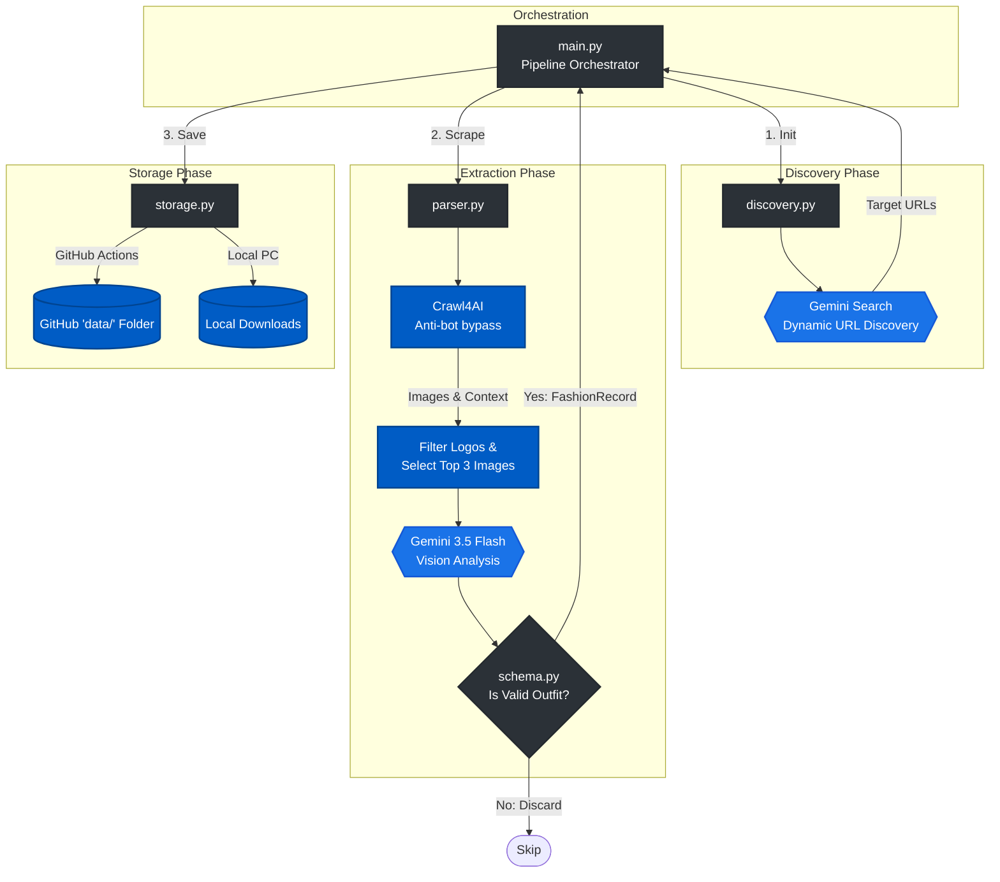

# Fashion Analytics Scraper

An autonomous fashion analytics pipeline that runs daily via GitHub Actions. It dynamically discovers independent fashion blogs, scrapes them using `crawl4ai`, extracts fashion metadata using Google Gemini (`gemini-3.5-flash`), and saves the structured data to the repository.

## Pipeline Architecture

## What It Scrapes

The scraper focuses on independent fashion blogs and forums. To ensure enough data is collected daily, the pipeline uses a **multi-run retry loop**:
1. **Dynamic Discovery**: A Gemini-powered search identifies small, active fashion blogs.
2. **Page Crawling**: `crawl4ai` fetches the target URL and extracts all images and readable markdown text.
3. **Filtering**: It ignores any image containing the word "logo" in its URL to ensure it captures actual content photos.
4. **Context & Vision Extraction**: It takes the **first 3 viable images** and the first 1000 characters of the webpage's text. These are sent to the Gemini Vision model for AI analysis based on a strict fashion taxonomy.
5. **Validation Check**: Images flagged as non-outfits (e.g. flat lays, products, landscapes) are explicitly rejected.
6. **Adaptive Retries**: If the entire batch yields **10 items or less**, the pipeline automatically launches another discovery run (instructing Gemini to find *different* URLs) and crawls again. It will attempt this up to **3 times** to reach the quota before terminating.

## Data Schema & Field Definitions

When Gemini processes an image and its context, it produces a structured JSON record. Below is an explanation of every field in the output and how it is populated:

* **`date_scraped`** (String): 
  * *Example*: `"2026-06-14"`
  * *How it's populated*: Automatically injected by the script (`datetime.now()`) on the day the crawl runs.
* **`source_url`** (String): 
  * *Example*: `"https://freelancersfashion.blogspot.com"`
  * *How it's populated*: The URL of the webpage where the image was found.
* **`clothing_style`** (String): 
  * *Example*: `"Corporate"`
  * *How it's populated*: Gemini analyzes the clothing in the image against a predefined list of styles (e.g., Casual, Haute Couture, Corporate, Streetwear) and selects the best match.
* **`hairstyle`** (String): 
  * *Example*: `"Updo"`
  * *How it's populated*: Gemini analyzes the subject's hair and selects a category (e.g., Updo, Long, Short, Unidentifiable).
* **`primary_colors`** (Array of Strings): 
  * *Example*: `["pink", "brown", "beige", "blue", "green"]`
  * *How it's populated*: Gemini detects the dominant colors of the outfit worn by the subject.
* **`is_trendsetter`** (Boolean): 
  * *Example*: `false`
  * *How it's populated*: The script analyzes the 1000-character text context. If the text contains keywords like "runway", "celebrity", "red carpet", or "model", this is set to `true`. Otherwise, it defaults to `false`.
* **`region`** (String): 
  * *Example*: `"EU"`
  * *How it's populated*: The script checks the text context for location keywords (like "paris", "milan", "london", "eu"). If found, it's flagged as `"EU"`, otherwise it defaults to `"US"`.
* **`confidence_score`** (Float): 
  * *Example*: `0.95`
  * *How it's populated*: Gemini assigns a confidence score (from 0.0 to 1.0) based on how clearly it can identify the fashion taxonomy in the image.
* **`image_url`** (String or Null): 
  * *Example*: `null`
  * *How it's populated*: For **GDPR Compliance**, the actual image URL is only retained if `is_trendsetter` is `true` (i.e., the person is a public figure or model). If they are a private citizen (`is_trendsetter = false`), the image URL is explicitly stripped and set to `null`.

## Setup

1. Create a `.env` file for local development or configure GitHub Secrets.
2. Provide your `GEMINI_API_KEY`.
3. The GitHub Actions workflow (`daily_scraper.yml`) runs daily at 00:00 UTC and automatically pushes new data to the `data/` folder.
