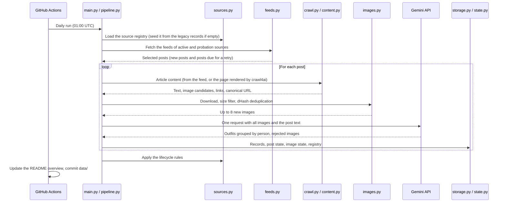

# Fashion Analytics Scraper
[](https://github.com/kleinnconrad/style_dataset/actions/workflows/ci.yml)

A fashion analytics pipeline that runs daily in GitHub Actions. It reads the RSS feeds of personal style blogs, renders new posts with `crawl4ai`, describes the outfits in their photos with Google Gemini (`gemini-2.5-flash`) and stores one record per outfit in this repository. A weekly job finds new blogs and maintains the list of sources without manual curation.

## Table of Contents
- [Dataset Overview](#dataset-overview)
- [Pipeline Architecture](#pipeline-architecture)
- [Sources and Post Selection](#sources-and-post-selection)
- [Source Lifecycle](#source-lifecycle)
- [Record Schema 2.0](#record-schema-20)
- [Data and State Files](#data-and-state-files)
- [Workflows](#workflows)
- [Configuration](#configuration)
- [Running Locally](#running-locally)
- [Dependency Management](#dependency-management)
- [Continuous Integration](#continuous-integration)
- [Setup](#setup)

## Dataset Overview
<!-- DATASET_OVERVIEW_START -->
**Last Updated:** 2026-10-10 06:48:27 UTC

- **Total Days/Files:** 119
- **Total Outfits:** 1457

| Variable | Description | Fill Rate | Distinct Values |
|----------|-------------|-----------|-----------------|
| `accessories` | List of visible accessories. | 86.6% (1262) | 565 |
| `age_group` | Visually estimated age bracket. | 94.0% (1370) | 6 |
| `bottom_garment_type` | The type of bottom being worn. | 59.8% (872) | 341 |
| `brand_mentions` | Fashion brands explicitly mentioned. | 11.7% (171) | 90 |
| `clothing_fit` | The overall fit of the clothing. | 93.9% (1368) | 4 |
| `clothing_style` | The primary fashion style. | 100.0% (1457) | 269 |
| `color_contrast_strategy` | How colors are paired. | 44.3% (646) | 5 |
| `color_palette_type` | The overall color theory of the outfit. | 94.0% (1370) | 5 |
| `confidence_score` | Model confidence score (0.0 to 1.0). | 100.0% (1457) | 10 |
| `date_scraped` | Automatically injected date. | 100.0% (1457) | 119 |
| `embellishments` | Visible decorative details. | 10.0% (146) | 94 |
| `fabric_textures` | Visually inferred materials. | 93.9% (1368) | 324 |
| `focal_point` | The standout piece that draws the eye. | 93.9% (1368) | 821 |
| `footwear_type` | The type of shoes being worn. | 34.8% (507) | 191 |
| `gender` | The perceived gender of the subject. | 100.0% (1457) | 3 |
| `hair_accessories` | Specific hair accessories. | 2.5% (36) | 21 |
| `hair_color` | Subject's hair color. | 93.0% (1355) | 79 |
| `hair_finish` | The styling finish of the hair. | 44.2% (644) | 6 |
| `hair_parting` | How the hair is parted. | 44.2% (644) | 5 |
| `hairstyle` | The primary hairstyle of the subject. | 100.0% (1457) | 693 |
| `hardware_details` | Visible metal or structural components. | 20.5% (299) | 149 |
| `hemline_length` | The hemline length for bottoms. | 17.7% (258) | 6 |
| `image_url` | Image URL of the subject (GDPR compliant). | 0.9% (13) | 12 |
| `is_trendsetter` | True if celebrity/model/artist, False if regular person. | 100.0% (1457) | 2 |
| `layering_complexity` | Scale from 1 (simple) to 5 (heavy layering). | 94.0% (1369) | 4 |
| `makeup_style` | Subject's makeup style. | 94.0% (1369) | 40 |
| `material_finish` | The optical quality of the fabrics. | 44.2% (644) | 4 |
| `neckline_style` | The cut of the top/dress around the neck. | 40.5% (590) | 7 |
| `occasion` | Intended event or setting for the outfit. | 44.3% (646) | 5 |
| `patterns` | Patterns visible on the clothing. | 94.0% (1369) | 234 |
| `pose_or_activity` | What the subject is doing. | 94.0% (1369) | 293 |
| `price_segment` | Inferred price segment. | 94.0% (1370) | 4 |
| `primary_colors` | List of dominant colors in the outfit. | 100.0% (1457) | 106 |
| `region` | Geographic region identified from context ('EU' or 'US'). | 100.0% (1457) | 2 |
| `seasonality` | The inferred season. | 94.0% (1370) | 5 |
| `sentiment_or_vibe` | The aesthetic vibe described. | 93.8% (1367) | 472 |
| `setting` | The setting or background of the photo. | 94.0% (1370) | 5 |
| `silhouette` | The overall outline or shape of the outfit. | 43.0% (626) | 6 |
| `source_url` | The URL of the webpage where the image was found. | 100.0% (1457) | 223 |
| `subculture_aesthetic` | Specific internet aesthetics or micro-trends. | 6.2% (91) | 50 |
| `top_garment_type` | The type of top being worn. | 93.3% (1359) | 657 |
| `waistline_rise` | The rise of the bottoms. | 27.5% (400) | 3 |
| `weather_conditions` | Inferred weather. | 77.1% (1123) | 46 |
<!-- DATASET_OVERVIEW_END -->

## Pipeline Architecture


```mermaid
sequenceDiagram
    participant Action as GitHub Actions
    participant Run as main.py / pipeline.py
    participant Reg as sources.py
    participant Feeds as feeds.py
    participant Page as crawl.py / content.py
    participant Img as images.py
    participant Gemini as Gemini API
    participant Store as storage.py / state.py

    Action->>Run: Daily run (01:00 UTC)
    Run->>Reg: Load the source registry (seed it from the legacy records if empty)
    Run->>Feeds: Fetch the feeds of active and probation sources
    Feeds-->>Run: Selected posts (new posts and posts due for a retry)
    loop For each post
        Run->>Page: Article content (from the feed, or the page rendered by crawl4ai)
        Page-->>Run: Text, image candidates, links, canonical URL
        Run->>Img: Download, size filter, dHash deduplication
        Img-->>Run: Up to 8 new images
        Run->>Gemini: One request with all images and the post text
        Gemini-->>Run: Outfits grouped by person, rejected images
        Run->>Store: Records, post state, image state, registry
    end
    Run->>Reg: Apply the lifecycle rules
    Action->>Action: Update the README overview, commit data/
```

## Sources and Post Selection

- **Registry.** The blogs are listed in `data/state/sources.json`. Nothing is curated by hand: the registry is seeded once from the domains of the legacy records, extended weekly by discovery, and maintained by fixed rules (see [Source Lifecycle](#source-lifecycle)).
- **Feeds.** Each run fetches the RSS or Atom feeds of the active sources and of the sources on probation. Posts published within the last 30 days that have not been processed yet are candidates. Posts whose title or tags indicate other topics (books, recipes, podcasts, interiors, giveaways, skincare, gift guides) are skipped.
- **Selection.** At most 3 posts per source and 40 posts per run, of which at most 10 come from sources on probation. The sources take turns, oldest posts first.
- **Content.** If the feed contains the full post with images, it is used directly; otherwise `crawl4ai` renders the post page. The article element is selected from the page, so that header, sidebar, related posts, share buttons and shop widgets are left out.
- **Republished posts.** Posts whose images were uploaded more than 12 months before the publish date (WordPress upload paths) are skipped, because their outfits would be dated wrongly.
- **Images.** At most 15 candidates per post are downloaded. The pipeline corrects the EXIF orientation, discards images with a shorter side below 400 px or a banner shape, and removes duplicates with a perceptual hash (dHash), within the post and against all images analyzed before. At most 8 images go to the model.
- **Extraction.** One Gemini request per post contains all images and the post text. The model groups the images that show the same person in the same outfit and returns one outfit per person and outfit; images without an outfit are listed with a reason. Brand names are kept only if they appear in the post's text, captions or link texts. Outfits of children and teenagers are not stored.

## Source Lifecycle

| Transition | Rule |
|---|---|
| Admission | The feed is found and has at least 2 posts in the last 60 days. Legacy sources with at least 5 legacy records start as `active`, all others on `probation`. |
| Not admitted | A site that blocks automated requests (HTTP 401 or 403) or has no feed is `rejected`. An unreachable site is `broken`. A feed with fewer than 2 posts in 60 days is `dormant`. |
| `probation` to `active` | At least 2 of the first 4 processed posts produced an outfit. |
| `probation` to `rejected` | 3 of the first 4 processed posts produced no outfit. |
| `active` to `retired` | Fewer than 25% of the last 12 processed posts produced an outfit. |
| To `dormant` | No post for more than 90 days. |
| Back from `dormant` | At least 2 posts in the last 60 days, checked weekly. The source returns to its previous status. |
| To `broken` | The feed failed on 7 consecutive daily runs. It is checked weekly and returns to its previous status when the feed works again. |

Further rules:
- Known domains are never proposed again, so `rejected` and `retired` sources stay out.
- At most 60 sources are `active` or on `probation` at the same time, and at most 10 new sources are admitted per week.
- The country of a source comes from Gemini with Google Search where available, otherwise from a country-code domain or from the region of the feed's language tag. The field `source_country_basis` records which.

## Record Schema 2.0

Each record describes one outfit of one person in one post. The models are defined in [src/schema.py](src/schema.py); the field table in the [Dataset Overview](#dataset-overview) lists every field with its description.

- **Outfit attributes:** framing, photo context (blogger or private person, brand campaign, editorial), gender, age group, style category and aesthetic tags, overall fit, silhouette, color palette and contrast, occasion, setting, season, weather, hair and makeup.
- **Garments:** one entry per garment, shoe and accessory with type and derived category, description, primary and secondary color, pattern, material, fit, length, neckline, rise, leg shape, finish and design details.
- **Fixed vocabularies:** all attributes except the free-text details use fixed lists of values. Absence is explicit: "Not visible" for attributes of the photo, "Not applicable" for garment attributes that do not apply to the item.
- **Provenance:** record id, schema version, model, extraction hash (prompt, schema and model settings), scrape and publish dates, source domain, country and language, post URL, title and tags, and the dHash and size of each image. Image URLs are not stored.

**Legacy records.** The records collected before the switch to schema 2.0 use schema 1.x. They were taken from blog homepages without deduplication and without publish dates, and many describe the same photos repeatedly. They remain unchanged in `data/` and are reported separately in the overview.

## Data and State Files

| Path | Content |
|---|---|
| `data/YYYY/MM/fashion_analytics_YYYY-MM-DD.json` | Records of one UTC day |
| `data/state/sources.json` | Source registry |
| `data/state/posts.json` | Processed posts with status and attempts |
| `data/state/images.json` | dHashes of all analyzed images |
| `data/state/run_log.jsonl` | One line per daily or weekly run, with counters and token usage |

The state files have a version key and one entry per line, and they are written atomically after every post.

## Workflows

| Workflow | Schedule | Purpose |
|---|---|---|
| `daily_scraper.yml` | Daily, 01:00 UTC | Runs the pipeline, updates the overview and commits `data/` and `README.md` |
| `source_discovery.yml` | Sundays, 12:00 UTC | Re-checks dormant and broken sources, looks up countries, discovers new blogs and commits `data/state/` |
| `email_notify.yml` | After data commits | Posts a commit comment that mentions the repository owner |
| `ci.yml` | Pull requests, pushes to `main` | Lint, tests and commit message checks |

The two data workflows share a concurrency group, so they never push at the same time, and they pull with rebase and retry before pushing. Processed posts are committed even if a later step of the run fails.

Manual runs (`workflow_dispatch`) accept a `mode`:
- `normal`: same as the scheduled run.
- `shadow`: runs on a copy of the state in a temporary folder and uploads it as an artifact; nothing is committed. Shadow runs use the same API key and quota as the scheduled runs.
- `dry-run` (daily workflow only): no model calls; uploads a report of the selected posts and images.

## Configuration

| Variable | Default | Purpose |
|---|---|---|
| `GEMINI_API_KEY` | none | API key for Gemini (required) |
| `GEMINI_MODEL` | `gemini-2.5-flash` | Model for extraction and discovery; stored in every record |
| `MAX_POSTS_PER_RUN` | 40 | Posts per daily run |
| `MAX_POSTS_PER_SOURCE` | 3 | Posts per source and run |
| `MAX_PROBATION_POSTS_PER_RUN` | 10 | Posts from sources on probation per run |
| `MAX_IMAGES_PER_POST` | 8 | Images per Gemini request |
| `MAX_GEMINI_CALLS_PER_RUN` | 50 | Gemini requests per daily run, including retries |
| `FEED_LOOKBACK_DAYS` | 30 | Age limit of new posts; unfinished posts are given up after this period |

Fixed thresholds, such as the lifecycle rules, are constants in the modules that use them.

## Running Locally

```bash
uv sync
uv run playwright install chromium                    # browser for crawl4ai, once
uv run python src/main.py --dry-run --max-posts 20    # no model calls, writes a report
uv run python src/main.py --max-posts 5               # processes 5 posts
uv run python src/discovery.py                        # weekly maintenance
```

Local runs write to `~/Downloads/style_dataset/` unless `--output-dir` is given; in GitHub Actions they write to `data/`. `--source DOMAIN` restricts a daily run to one or more sources. `scripts/try_extraction.py` runs the extraction on a fixed set of posts and writes an HTML review sheet.

## Dependency Management

This project uses [uv](https://docs.astral.sh/uv/) with a lockfile for reproducible builds.

1. **Dependencies**: `pyproject.toml` declares the direct dependencies; development tools (pytest, ruff) are in the `dev` dependency group.
2. **Lockfile**: `uv.lock` pins the complete dependency tree. After changing `pyproject.toml`, run `uv lock` and commit both files.
3. **Automated Updates**: Dependabot (`.github/dependabot.yml`) checks weekly for updates of the Python dependencies (`uv` ecosystem, updating `pyproject.toml` and `uv.lock` together) and of the GitHub Actions, each grouped into a single pull request.

## Continuous Integration

The `CI` workflow (`.github/workflows/ci.yml`) runs on every pull request and on pushes to `main`:

| Job | Checks |
|---|---|
| `Lint` | `uv.lock` matches `pyproject.toml`; `ruff check`; `actionlint` (including `shellcheck`) on the workflow files |
| `Tests` | The tests in `tests/` on Python 3.11 and 3.14. They run offline, with fakes for the web, the browser and the Gemini API, and also check that every module in `src/` and `scripts/` imports with the locked dependencies. |
| `Conventional Commits` | Every commit of a pull request follows the Conventional Commits format (pull requests only) |
| `CI passed` | Succeeds only if all jobs above succeeded or were skipped; use it as the single required status check in the branch protection of `main` |

Run the Python checks locally before pushing:
```bash
uv lock --check
uv run ruff check .
uv run pytest
```

## Setup

1. Add the repository secret `GEMINI_API_KEY` under **Settings > Secrets and variables > Actions**. For local runs, put it into a `.env` file.
2. Allow workflows to push to the repository under **Settings > Actions > General > Workflow permissions**.
3. The first daily run seeds the source registry from the legacy records, which takes about a minute.

Copyright (c) 2026 Conrad Kleinn. All rights reserved.
