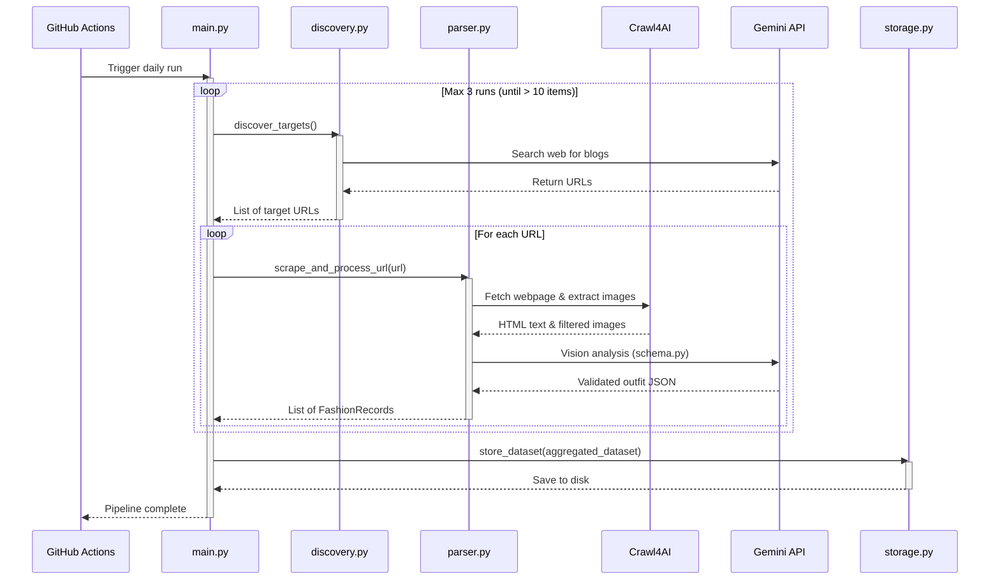

# Fashion Analytics Scraper

An autonomous fashion analytics pipeline that runs daily via GitHub Actions. It dynamically discovers independent fashion blogs, scrapes them using `crawl4ai`, extracts fashion metadata using Google Gemini (`gemini-2.5-flash`), and saves the structured data to the repository.

## Table of Contents
- [Dataset Overview](#dataset-overview)
- [Pipeline Architecture](#pipeline-architecture)
- [What It Scrapes](#what-it-scrapes)
- [Dependency Management](#dependency-management)
- [Setup](#setup)

## Dataset Overview
<!-- DATASET_OVERVIEW_START -->
**Last Updated:** 2026-10-08 07:06:32 UTC

- **Total Days/Files:** 117
- **Total Outfits:** 1431

| Variable | Description | Fill Rate | Distinct Values |
|----------|-------------|-----------|-----------------|
| `accessories` | List of visible accessories. | 86.7% (1241) | 549 |
| `age_group` | Visually estimated age bracket. | 93.9% (1344) | 6 |
| `bottom_garment_type` | The type of bottom being worn. | 59.7% (854) | 338 |
| `brand_mentions` | Fashion brands explicitly mentioned. | 11.2% (160) | 90 |
| `clothing_fit` | The overall fit of the clothing. | 93.8% (1342) | 4 |
| `clothing_style` | The primary fashion style. | 100.0% (1431) | 265 |
| `color_contrast_strategy` | How colors are paired. | 43.3% (620) | 5 |
| `color_palette_type` | The overall color theory of the outfit. | 93.9% (1344) | 5 |
| `confidence_score` | Model confidence score (0.0 to 1.0). | 100.0% (1431) | 10 |
| `date_scraped` | Automatically injected date. | 100.0% (1431) | 117 |
| `embellishments` | Visible decorative details. | 10.0% (143) | 93 |
| `fabric_textures` | Visually inferred materials. | 93.8% (1342) | 319 |
| `focal_point` | The standout piece that draws the eye. | 93.8% (1342) | 809 |
| `footwear_type` | The type of shoes being worn. | 35.0% (501) | 190 |
| `gender` | The perceived gender of the subject. | 100.0% (1431) | 3 |
| `hair_accessories` | Specific hair accessories. | 2.4% (35) | 21 |
| `hair_color` | Subject's hair color. | 92.9% (1329) | 79 |
| `hair_finish` | The styling finish of the hair. | 43.2% (618) | 6 |
| `hair_parting` | How the hair is parted. | 43.2% (618) | 5 |
| `hairstyle` | The primary hairstyle of the subject. | 100.0% (1431) | 683 |
| `hardware_details` | Visible metal or structural components. | 20.5% (293) | 146 |
| `hemline_length` | The hemline length for bottoms. | 17.6% (252) | 6 |
| `image_url` | Image URL of the subject (GDPR compliant). | 0.9% (13) | 12 |
| `is_trendsetter` | True if celebrity/model/artist, False if regular person. | 100.0% (1431) | 2 |
| `layering_complexity` | Scale from 1 (simple) to 5 (heavy layering). | 93.9% (1343) | 4 |
| `makeup_style` | Subject's makeup style. | 93.9% (1343) | 40 |
| `material_finish` | The optical quality of the fabrics. | 43.2% (618) | 4 |
| `neckline_style` | The cut of the top/dress around the neck. | 39.8% (569) | 7 |
| `occasion` | Intended event or setting for the outfit. | 43.3% (620) | 5 |
| `patterns` | Patterns visible on the clothing. | 93.9% (1343) | 230 |
| `pose_or_activity` | What the subject is doing. | 93.9% (1343) | 290 |
| `price_segment` | Inferred price segment. | 93.9% (1344) | 4 |
| `primary_colors` | List of dominant colors in the outfit. | 100.0% (1431) | 105 |
| `region` | Geographic region identified from context ('EU' or 'US'). | 100.0% (1431) | 2 |
| `seasonality` | The inferred season. | 93.9% (1344) | 5 |
| `sentiment_or_vibe` | The aesthetic vibe described. | 93.7% (1341) | 465 |
| `setting` | The setting or background of the photo. | 93.9% (1344) | 5 |
| `silhouette` | The overall outline or shape of the outfit. | 41.9% (600) | 6 |
| `source_url` | The URL of the webpage where the image was found. | 100.0% (1431) | 220 |
| `subculture_aesthetic` | Specific internet aesthetics or micro-trends. | 5.9% (85) | 46 |
| `top_garment_type` | The type of top being worn. | 93.2% (1333) | 646 |
| `waistline_rise` | The rise of the bottoms. | 27.0% (387) | 3 |
| `weather_conditions` | Inferred weather. | 77.3% (1106) | 44 |
<!-- DATASET_OVERVIEW_END -->

## Pipeline Architecture


```mermaid
sequenceDiagram
    participant Action as GitHub Actions
    participant Main as main.py
    participant Disc as discovery.py
    participant Parse as parser.py
    participant Crawl as Crawl4AI
    participant Gemini as Gemini API
    participant Store as storage.py
    
    Action->>Main: Trigger daily run
    activate Main
    
    loop Max 3 runs (until > 10 items)
        Main->>Disc: discover_targets()
        activate Disc
        Disc->>Gemini: Search web for blogs
        Gemini-->>Disc: Return URLs
        Disc-->>Main: List of target URLs
        deactivate Disc
        
        loop For each URL
            Main->>Parse: scrape_and_process_url(url)
            activate Parse
            Parse->>Crawl: Fetch webpage & extract images
            Crawl-->>Parse: HTML text & filtered images
            Parse->>Gemini: Vision analysis (schema.py)
            Gemini-->>Parse: Validated outfit JSON
            Parse-->>Main: List of FashionRecords
            deactivate Parse
        end
    end
    
    Main->>Store: store_dataset(aggregated_dataset)
    activate Store
    Store-->>Main: Save to disk
    deactivate Store
    
    Main-->>Action: Pipeline complete
    deactivate Main
```

## What It Scrapes

The scraper focuses on independent fashion blogs and forums. To ensure enough data is collected daily, the pipeline uses a **multi-run retry loop**:
1. **Dynamic Discovery**: A Gemini-powered search identifies small, active fashion blogs.
2. **Page Crawling**: `crawl4ai` fetches the target URL and extracts all images and readable markdown text.
3. **Filtering**: It ignores any image containing the word "logo" in its URL to ensure it captures actual content photos.
4. **Context & Vision Extraction**: It takes the **first 3 viable images** and the first 1000 characters of the webpage's text. These are sent to the Gemini Vision model for AI analysis based on a strict fashion taxonomy.
5. **Validation Check**: Images flagged as non-outfits (e.g. flat lays, products, landscapes) are explicitly rejected.
6. **Adaptive Retries**: If the entire batch yields **10 items or less**, the pipeline automatically launches another discovery run (instructing Gemini to find *different* URLs) and crawls again. It will attempt this up to **3 times** to reach the quota before terminating.

## Dependency Management

This project uses the "Lockfile Pattern" via `pip-tools` for reproducible builds and streamlined dependency updates.

1. **Top-Level Dependencies**: Defined in `requirements.in`. This file only lists direct dependencies required by the project.
2. **Pinned Dependencies**: `requirements.txt` is generated automatically from `requirements.in` using `pip-compile`. This locks all dependencies and sub-dependencies to specific versions.
3. **Automated Updates**: Dependabot is configured (`.github/dependabot.yml`) to automatically check for updates weekly and group all Python dependency updates into a single pull request.

To update dependencies locally, modify `requirements.in` and run:
```bash
pip-compile requirements.in
```

## Setup

1. Create a `.env` file for local development or configure GitHub Secrets.
2. Provide your `GEMINI_API_KEY`.
3. The GitHub Actions workflow (`daily_scraper.yml`) runs daily at 00:00 UTC and automatically pushes new data to the `data/` folder.

Copyright (c) 2026 Conrad Kleinn. All rights reserved.
